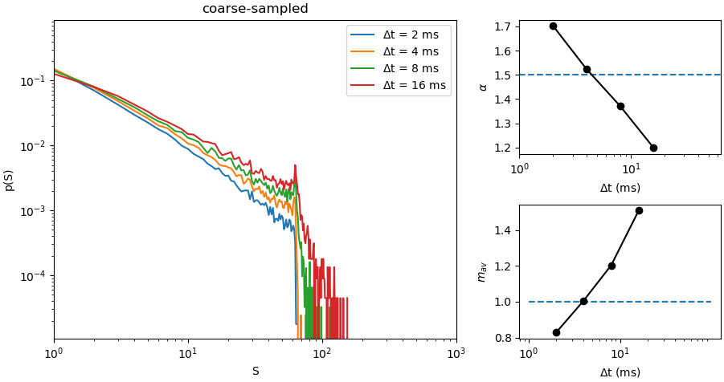

# criticalavalanches

This simulation and analysis package implements the model described in (Pinheiro Neto et al, 2019).

## Demonstration

Lets run the model and show that a considerably subcritical network with `m=0.9` (and an intrinsict timescale of ~20 ms) with a reasonable inter-electrode distance of `de = 4` (corresponding to 200 micrometers in experiments) can reproduce experimental coarse-sampled results of arguably critical networks.
First we build and run the model, which is written in C++ and requires the [hdf5](https://www.hdfgroup.org/downloads/hdf5/) library (for troubleshooting, read the simulation details below):
```
make cc
./exe/cc -o subcritical.hdf5  -m 0.9 -h 2e-4 -de 4 -T 1000000 -N 160000
```
This runs the subcritical dynamics for `1e6` timesteps (equivalent to ~33 min of recordings) with a population rate of `1 Hz`. For practicity, the dataset generated by this simulation is available [HERE](https://www.dropbox.com/s/s80faempe1hd3hs/subcritical.hdf5?dl=1).

The analysis is done in Python, and depends on the following packages: powerlaw, h5py and scipy. These can be installed with `pip install powerlaw h5py scipy`.

From an interactive Python session, we then run:

 ```
 import sys
 sys.path.insert('ana/')
 import analysis
 analysis.sim_plot_deltaT('subcritical.hdf5',[1,2,4,8],'coarse')

```
This analyzes and plots the observables discussed in the paper for binsizes in the range `1-8` timesteps, corresponding to 2-16 ms. The resulting plots should look like this:



## Simulation details

The simulation is written in C++ and relies on the [hdf5](https://www.hdfgroup.org/downloads/hdf5/) library to write its output.
Depending on your platform, this may be installed manually from above link or using a package manager. For instance, on macOS it is available via [Homebrew](https://brew.sh/index_de).

```
brew install hdf5
```

while for Ubuntu it can be installed with
```
sudo apt-get install libhdf5-dev
````

If installed via a package manager, the compiler should automatically find the libraries. If you get problems compiling, edit the makefile to tell the compiler where hdf5 is located (e.g. `IFLAGS = -L /usr/lib/x86_64-linux-gnu/hdf5/serial -I /usr/include/hdf5/serial`). To get an idea where the libraries are located on your system try `which h5cc` or `whereis hdf5.h`.

To compile the simulation, `cd` into the cloned directory and

```
make
```

The resulting exectuable `./exe/cc` takes the following arguments:

```
"-o"   type: string   required         // output path for results

"-T"   type: double   default: 1e5     // number of time steps
"-t"   type: double   default: 1e3     // thermalization steps before measuring
"-N"   type: integer  default: 160000  // number of neurons
"-k"   type: integer  default: 1000    // average outgoing connections per neuron
"-e"   type: integer  default: 64      // total number of electrodes
"-dn"  type: double   default: 50.     // inter-neuron (nearest-neigbour) distance
"-de"  type: double   default: 8.      // electrode dist. [unit=nearestneur-dist]
"-s"   type: integer  default: 314     // seed for the random number generator
"-m"   type: double   default: .98     // branching parameter applied locally
"-g"   type: double   default: 6.      // eff. conn-length [unit=nearestneur-dist]
"-h"   type: double   default: 4e-5    // probability for spontaneous activation
"-c"   type: double   default: 1e5     // [num time steps] before hist is written
```

To run the simulation:

```
./exe/cc -o ./dat/testrun.hdf5
```

## Dataset analysis

The analysis package is written in Python, and depends on the following packages: `h5py, scipy, powerlaw`.  After running a simulation and obtaining `testrun.hdf5`, the easiest way to analyze the results is to add `ana/` to the python path, and run

```
import analysis
analysis.sim_plot_deltaT('testrun.hdf5',[1,2,4,8],'coarse')
analysis.sim_plot_deltaT('testrun.hdf5',[1,2,4,8],'sub')
```

where `[1,2,4,8]` is the vector of binsizes (in units of timesteps) to use. That should analyze the dataset and plot the avalanche-size distribution, fitted exponent of the power-law, and estimated branching parameter. The function can take other optional parameters, described in the docstring. In order to compare different datasets `dataset_A.hdf5` and `dataset_B.hdf5` (with e.g. different inter-electrode distances), one can also run

```
import analysis
analysis.sim_plot_pS('dataset_A.hdf5',4,'both', str_leg='Dataset A')
analysis.sim_plot_pS('dataset_B.hdf5',4,'both', str_leg='Dataset B')
```

which plots `both` coarse-sampled and sub-sampled avalanche-size distributions for datasets A and B with `deltaT=4` timesteps.

## Batch analysis

Batch data generated by the simulation can be analyzed executing `run_analysis.py`, and figures similar to the ones in the main paper can be generated using `generate_figures.py`. A list of the arguments can be obtained with `python ana/run_analysis.py --help`. Arguments not used in the corresponding mode (e. g. `--binsize` for `--mode threshold`) will be ignored.

The data format must end in `_r[nn].hdf5` where [nn] corresponds to `n` realizations of the simulation, and must be ordered from `00` to `n-1`.

For demonstration, here we will use the following datasets:
```
dat/m0.98000_h4.000e-05_de02_ga-1.00_r00.hdf5
dat/m0.98000_h4.000e-05_de02_ga-1.00_r01.hdf5
dat/m0.98000_h4.000e-05_de02_ga-1.00_r02.hdf5
```

The first step is to threshold the data:
```
python ana/run_analysis.py --mode threshold --data_dir dat --reps 3
```
To do the avalanche analysis on the thresholded data and save the avalanche-size distribution p(S) we can then run

```
python ana/run_analysis.py --mode save_ps --data_dir dat/ --binsize 1,2,4,8,16
```


